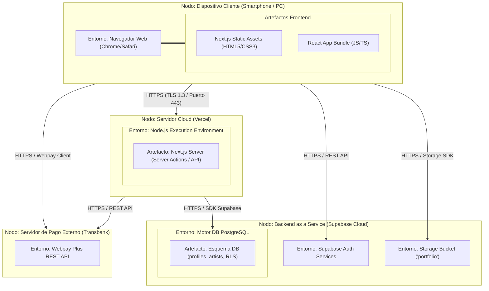

# Diagrama de Despliegue: Plataforma Black Ink Tattoo

Este documento contiene el **Diagrama de Despliegue** detallado de la plataforma **Black Ink Tattoo**. Ilustra la arquitectura física del sistema, detallando el hardware, los entornos de ejecución, los componentes lógicos (artefactos) y los protocolos de comunicación utilizados para interconectar los servidores y servicios en la nube.

---

## 1. Diagrama de Despliegue (Imagen y Código)

### A. Imagen del Diagrama de Despliegue
A continuación se presenta la versión gráfica del diagrama en formato profesional en blanco y negro (monocromático):

### B. Código Mermaid para Visualización Dinámica
A continuación se detalla el diagrama en código **Mermaid** para edición o renderizado dinámico:

---

## 2. Descripción de Nodos de Despliegue

### A. Dispositivo Cliente
*   **Hardware / Entorno:** Computadora de escritorio, tablet o smartphone del usuario.
*   **Software de Ejecución:** Navegador Web moderno compatible con HTML5/CSS3 y JavaScript (ej. Chrome, Safari, Firefox).
*   **Artefactos Alojados:** Archivos estáticos de Next.js, hojas de estilo CSS compiladas y bundles de JavaScript compilados en el cliente para la UI dinámica.

### B. Servidor de Alojamiento Frontend (Vercel Cloud Hosting)
*   **Hardware / Entorno:** Servidor en la nube provisto por la plataforma **Vercel** que opera de forma serverless y autogestionada.
*   **Software de Ejecución:** Entorno Node.js encargado del procesamiento en el servidor (Server-Side Rendering / Server Actions).
*   **Artefactos Alojados:** Lógica de servidor de Next.js y endpoints de API del frontend.

### C. Backend en la Nube (Supabase)
*   **Hardware / Entorno:** Servidor en la nube administrado por **Supabase** que integra diferentes servicios backend listos para producción.
*   **Software de Ejecución:**
    *   **PostgreSQL Engine:** Base de datos relacional para persistir la información.
    *   **GoTrue (Auth Service):** Sistema de gestión de usuarios y tokens JWT de autenticación.
    *   **Supabase Storage:** Sistema de almacenamiento de objetos estáticos para fotos.
*   **Artefactos Alojados:** Esquema de base de datos (`public.profiles`, `public.artists`, políticas de seguridad RLS) y el bucket de portafolio (`portfolio`).

### D. Servidores de Pasarela Externa (Transbank)
*   **Hardware / Entorno:** Servidores seguros externos propiedad de **Transbank**.
*   **Software de Ejecución:** Pasarela API REST de Webpay Plus.
*   **Artefactos Alojados:** Sistema simulado de validación de tarjetas de crédito/débito y generación de códigos de autorización.

---

## 3. Protocolos de Comunicación Utilizados
*   **HTTPS (TLS 1.3):** Protocolo seguro utilizado de extremo a extremo para todas las comunicaciones de red sobre el puerto 443, protegiendo las credenciales y datos de transacciones del cliente contra ataques de intermediarios.
*   **REST API:** Arquitectura de comunicación estándar de peticiones HTTP (GET, POST, PUT, DELETE) utilizada para el intercambio de datos entre el Frontend, Supabase y los servicios de pago de Webpay.
