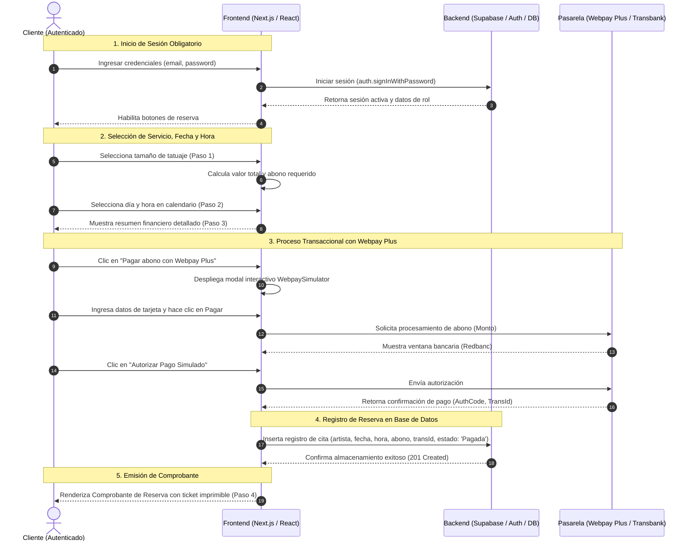

# Diagrama de Secuencia: Proceso de Agendamiento de Cita

Este documento contiene el **Diagrama de Secuencia** detallado para el flujo de trabajo de agendamiento de citas con pago de garantía (Webpay Plus) en la plataforma **Black Ink Tattoo**. Ilustra el intercambio de mensajes cronológico entre los actores y componentes del sistema.

---

## 1. Diagrama de Secuencia en Código Mermaid

A continuación, se detalla el diagrama de secuencia interactivo desarrollado en **Mermaid** que modela la interacción temporal del sistema:

---

## 2. Descripción de Flujo Cronológico

1.  **Autenticación:** El Cliente inicia sesión. El Frontend solicita la validación a Supabase Auth, el cual retorna los metadatos de sesión válidos.
2.  **Configuración de Cita:** El Cliente escoge su servicio (Tatuaje Pequeño, Mediano, Grande, Cover Up) y el sistema calcula el abono. Luego, escoge una fecha y hora disponible.
3.  **Procesamiento de Pago (Webpay):** El Cliente inicia el pago de garantía. Se abre el simulador de Webpay, se ingresan los datos de tarjeta, se solicita autorización a Transbank y se simula la autenticación bancaria en Redbanc. Transbank retorna el código de autorización y el ID de transacción.
4.  **Confirmación y Persistencia:** Con el pago aprobado, el Frontend realiza una inserción segura en Supabase para registrar la reserva y bloquear el bloque de horario en el calendario.
5.  **Entregable:** Se emite el ticket oficial en PDF/Pantalla con sello de "Pago Aprobado" para el cliente.
